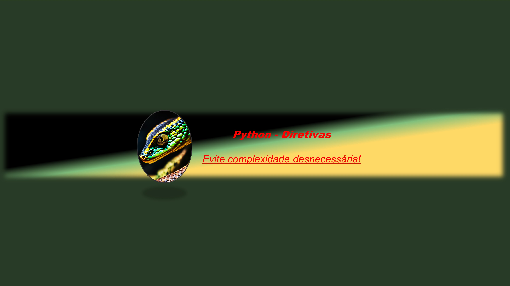

#  

## Diretivas no Python:
>- Diretivas no Python são instruções que orientam o comportamento do código. Elas podem incluir importações de módulos, declaração de funções e classes, entre outras ações fundamentais para a execução do programa.

## Diretivas Estruturais:
>- Diretivas estruturais são instruções que organizam o fluxo de execução do programa. Elas incluem estruturas de controle, como condicionais (if-else) e loops (for, while), permitindo que o código seja executado de maneira condicional ou repetitiva.

## Diretivas de Atributos:
>- Diretivas de atributos são instruções que definem propriedades ou características de elementos em um programa. No contexto de Python, isso pode envolver a definição de atributos de classe ou métodos especiais para manipular atributos de objetos.

### Outros exemplos de diretivas em python  
>- Diretivas de Importação: Permitem trazer funcionalidades de outros módulos para o seu código, utilizando a palavra-chave.

>- Diretivas de Definição de Funções e Classes: Permitem definir funções e classes, estruturando o código em blocos reutilizáveis e organizados.

>- Diretivas de Atribuição e Manipulação de Variáveis: Atribuem valores a variáveis e realizam operações de manipulação, como incremento, atribuição condicional, entre outros.

>- Diretivas de Exceção e Tratamento de Erros: Gerenciam exceções e erros que podem ocorrer durante a execução do programa, permitindo lidar com eles de maneira controlada.

## Conclusão:
>- Curta minha jornada de aprendizado e descoberta nas redes sociais! Siga-me para ficar por dentro das últimas novidades e dicas sobre tecnologia e programação. Artigos feito por inteligência artificial e revisado por humano. Juntos, podemos explorar o fascinante mundo do desenvolvimento front-end! #TechJourney #FrontEnd #LearningInProgress

